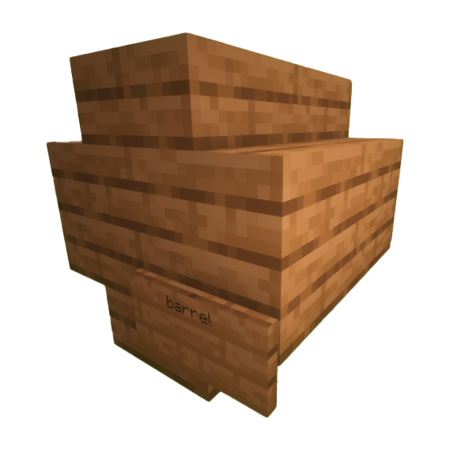
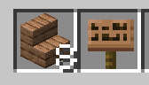
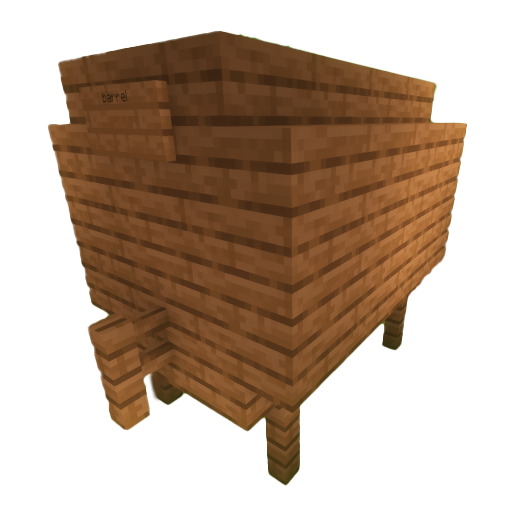
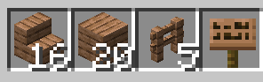

# 0.酿酒引言与核心流程
欢迎来到红白阁的精酿世界！在这里，你可以通过不同的配方和工序，酿造出上百种饮品。不仅有强力增益，喝多了还会触发各种“发酒疯”的奇妙事件！

酿酒的基本公式只有三步：

① 煮制（提取原料）

② 蒸馏（提纯，部分需要）

③ 木桶陈酿（发酵出味，部分需要）

掌握这三步，你就能成为酿酒大师。

# 1.万物的起源————煮制

## 准备： 炼药锅、热源（火/岩浆等）、水、*钟表（可选）*。

操作： 扔原料 ➔ 等待（酿造的时间极其重要） ➔ 玻璃瓶装瓶。

**💡 酿酒师小贴士： 拿着钟表右击炼药锅可以精确查看煮了多久，时间差一分钟，酿出来的品质可能就天差地别！**

## 2.蒸馏（提纯酒液）
将原浆放入酿造台底部，顶部放**萤石粉**作为催化剂。

💡 酿酒师小贴士：萤石粉在此过程中仅作为催化剂，不会被消耗。
   注意，并非所有配方都需要蒸馏，比如茶类通常煮完即可。

## 3.陈酿与酒桶设施

*很多高级酒类（如威士忌、红酒）需要放在酒桶中经历岁月的沉淀。使用的木板材质会直接影响酒的风味！*

> 酿造设施
> 原版木桶、小木桶、大木桶

### 1. 原版木桶
> 入门首选  

用法：随便放一个原版木桶，把酒塞进去即可。适合存放少量、简单的饮品

### 2. 小木桶/大木桶

>空间更大！大木桶能同时发酵更多的酒，是开酒馆的必备设施。

#### 小木桶

#### 所需材料

#### 大木桶

##### 所需材料

# 激活方式
搭建完成后，在指定位置放上告示牌，写上 `barrel`。如果提示`木桶已创建`，就可以空手右键打开了！

# 4. 存储佳酿
> 当你的酒达到了**完美品质**，继续放在桶里可能会发酵过头变成废水。此时就需要使用**封装台**！

#### 效果： 封装后的酒液状态将被“锁定”，不再发生变化。虽然隐藏了具体参数，但非常适合用来作为商品在玩家间交易。

# 5.饮用与醉酒系统

>喝好酒怡情，喝劣质酒（或喝太多）会导致走路扭曲、胡言乱语，甚至断片(物理意义)哦。

- 无法正常行走，路线扭曲
- 失明、反胃、中毒等效果
- 聊天的内容会随醉酒情况改变，玩家写下的告示牌内容可能无法被理解，甚至无厘头
- 大量摄入酒精可能呕吐
- 酒后退出游戏，玩家在此后的短时间内可能无法进入游戏
- 过度饮酒后，玩家可能会晕倒（断开连接）

# 6.醒酒指南

- 自然醒酒： 挂机等酒劲过去
- 原汤化原食： 喝点“醒酒茶”或者牛奶快速解酒。
- 断片警告： 严重醉酒下线，第二天上线可能会随机出生在荒郊野外，体验真正的“喝断片”。

# 7.附录：图鉴

这里的图鉴只展示了最终成品的名字，具体的配方和时间比例，需要各位酿酒师自己在游戏中探索，或者向其他老玩家购买配方！

### **尚存**

|      基础      |  酿造变种/中间态  |     酿造 (完美品质)     |
| :------------: | :---------------: | :---------------------: |
|    粗制啤酒    |       啤酒        |    **CORONA EXTRA**     |
|     淡红酒     |       红酒        |   **『透虹浪漫红酒』**   |
|    淡葡萄酒    |      葡萄酒       |    **『映夜葡萄酒』**    |
|   粗制蜂蜜酒   |      蜂蜜酒       |     **『双层蜜酒』**     |
|   粗制威士忌   |      威士忌       |      **尊尼获加**       |
|     淡咖啡     |       咖啡        |      **Espresso**       |
|    暗淡金酒    |       金酒        |     **『代时金酒』**     |
|    粗制朗姆    |       朗姆        |     **『沉润朗姆』**     |
|   粗制伏特加   |      伏特加       |    **Absolut Vodka**    |
|  粗制龙舌兰酒  |     龙舌兰酒      |   **『宾柔龙舌兰』**     |
|   粗制苦艾酒   |      苦艾酒       |    **『留香苦艾酒』**    |
|    浑浊蛋酒    |       蛋酒        |     **『泡泡蛋酒』**     |
|  劣质蒲公英酒  |     蒲公英酒      |      **『三月雪』**      |
|   发酵苹果汁   |      苹果酿       |   **『提神苹果佳酿』**   |
|   浑浊葵花酒   |    蜜酿葵花酒     |     **『蜜液金花』**     |
|  劣质黄油啤酒  |     黄油啤酒      |       **『暖意』**       |
|     混合物     |      答辩水       |     **『腐殖之水』**     |
|    劣质竹酒    |       竹酒        |     **『王竹瑞佑』**     |
|     南瓜碎     |      南瓜汁       |    **『醇香南瓜汁』**    |
|   浑浊玫瑰酒   |      玫瑰酒       |     **『红情一心』**     |
|    工业废水    |   重金属蒸馏液    |      **鎏金陈酿**       |
|   罗辑快乐酒   |     奇特的酒      |     **沉船中的酒**      |
|    一瓶水晶    |    紫色悬浊液     |     **碎晶花酿**       |
|    樱花甜酿    |       樱咲        | **Spring·Sakura·Sweet** |
|    湛蓝之忆    | 瓦尔登蓝钻·含酒版 |     **Sea = Azure**     |
|    假冒樱酒    |       粉霞        |      **Sea = Pink**     |
|    灼红烈酒    |    海之血·夕烧    |      **Sea = Red**      |
|   掺水伏特加   |    混沌伏特加     |     **霜炙伏特加**      |
|    螺丝起子    |         /         |            /            |
|   白色俄罗斯   |         /         |            /            |
|   铃兰花茶     |  洁白森林的晨曦  |      **无暇之春**       |
|      兰香      |    沼泽交响曲     |     **红树·蓝花**       |
|     涩绿茶     |       绿茶        |     **『精制绿茶』**     |
|     淡红茶     |       红茶        |    **昏睡红茶（悲**     |
|    醒酒茶      |         /         |            /            |
|   温水牛奶     |         /         |            /            |
|   冰镇牛奶     |         /         |            /            |
|    [ 扶摇 ]    |         /         |            /            |
|     seatea     |         /         |            /            |
|      冷水      |       冰水        |       **寒冬**          |
|     白兰地     |    优质白兰地     |      **Hennessy**       |
|     雪莉酒     |    优质雪莉酒     |     **瓶里的阳光**      |
|  冰镇不详之瓶  |         /         |            /            |
|   劣品莫吉托   |      莫吉托       |    **[晨间洋流]**       |
|    苏打水      |         /         |            /            |
|    一般茶水    |       普洱        |     **熟成普洱茶**      |
|    一般茶水    |     茉莉花茶      |      **茉莉蜜茶**       |
|   劣质龙井     |       龙井        |      **西湖龙井**       |
|   劣质铁观音   |      铁观音       |      **沉璧铁观音**     |
|    · 云游 ·    |         /         |            /            |
|  · ·扶摇· ·    |         /         |            /            |
| ··· · - 飞鸟 - · ··· |    /     |            /            |
|    萃取剂      |         /         |            /            |
|  萃取液：幻翼  |         /         |            /            |
| 萃取液：末影龙 |         /         |            /            |
|   [ 龙·梦 ]    |         /         |            /            |

### **失落**

| 佳酿：小蛋糕 | 优醇：小蛋糕 | 国窖：小蛋糕 |
| ------------ | ------------ | ------------ |
|              |              |              |

> 多多和老玩家交流(~~骚扰~~)吧，或许可以从他们手中爆出绝版酒谱呢😀             ——Icy_Cola0406

