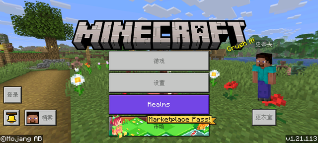
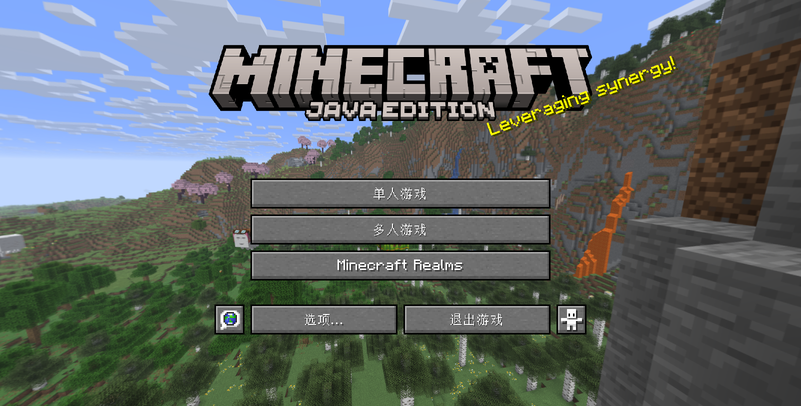

# **什么是Java什么是基岩**

## **Minecraft账户/版本常识**

在选择启动器之前,首先我们要了解一些Minecraft账户/版本常识,以免发生认知偏差.

 

如果你是一个新手玩家(或者没有了解过此类内容的老玩家),可能会认为Minecraft分为网易版,基岩版,教育版,手机版,电脑版等等乱七八糟的版本

实际上,Minecraft(这里指正作,不包括地下城等衍生游戏)只有两个版本,即**Java版**和**基岩版**.

 

基本上**所有在手机上**的Minecraft版本都是**基岩版**(包括网易代理的Minecraft手机版)

此外,教育版,360版,Win10版等版本也是基岩版(或基于基岩版开发)

> 图为基岩版启动界面

Java版则是**基于Java运行的Minecraft版本**,也是Minecraft的原生版本.你可以在Mac,Windows或Linux,甚至是任何一台装载Java且支持OpenGL的设备上运行.**大部分在电脑上运行的Minecraft都是Java版 **(Win10版等除外,那是基岩版).

*实际上大多数MC主播或up主主要玩的都是java版，因为java版有比较稳定的特性（？）且生态更好*

> 图为Java版启动界面

手机通过**特制启动器**也可以运行Java版Minecraft(如PojavLuncher等)