# 如何游玩服务器
## 加入qq群

* 如果您从其他渠道获得了本服务器的文档链接，您需要先加入**服务器官方群** https://qm.qq.com/q/5csKgUEZ3O 以正常游玩

* 如果您使用PC（JAVA版），请继续看，如果您使用基岩版，登录微软账户之后可直接填写服务器信息游玩

## 注册账号
1.	打开以下链接 **红白阁-Redwhite:** https://bs.samuge.red
2.	左键点击现在注册 
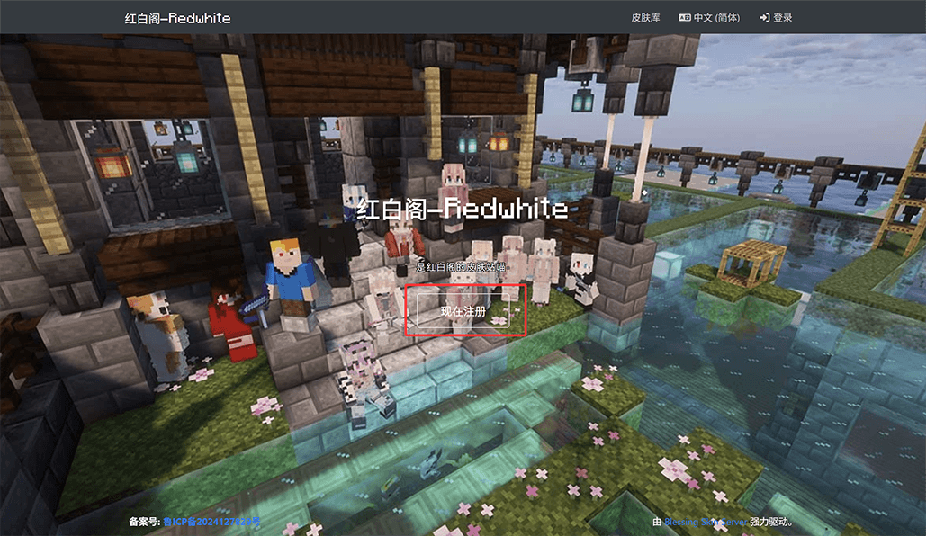
3.	您将看到如下页面，按照要求填写您的信息 
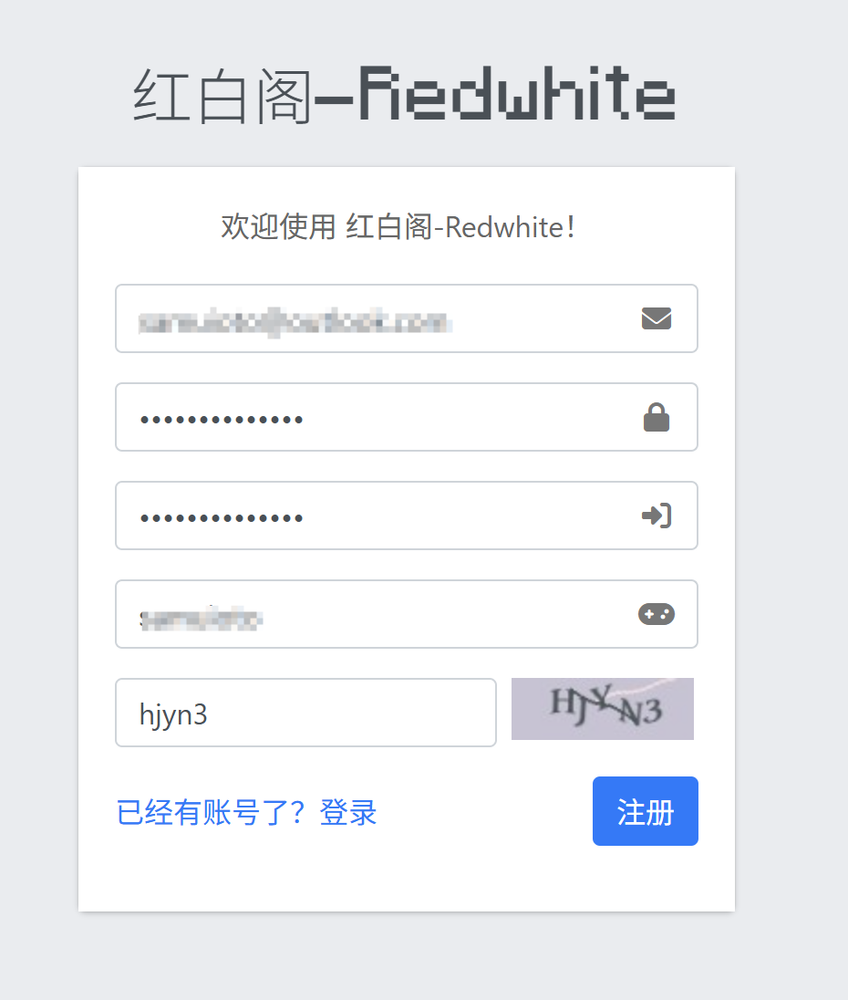

* 如果您没有邮箱，您可以直接将您的QQ号@qq.com作为邮箱号使用
* 例如：123123123@qq.com
* “游戏内角色名”就是您在Minecraft中的玩家ID，注册成功后，它将作为您的身份在游戏中显示
* “游戏内角色名”不允许重名，如果您遇到下图的情况，请更换角色名后重试

4. 如果没有问题，过一小会您会看到如下页面
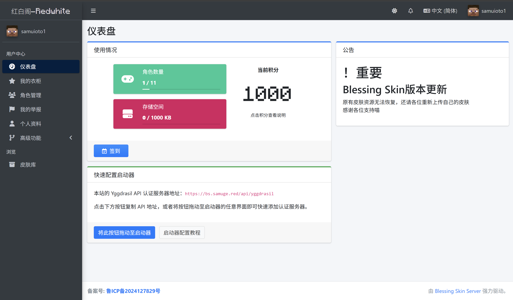 
这说明您已经注册成功，请继续根据教程说明完成设置
* 如果遇到问题请联系群内管理员
## 使用外置登录
### 方法一
* 使用本站自带的拖拽方式，将这个按钮拖拽到您的启动器界面 
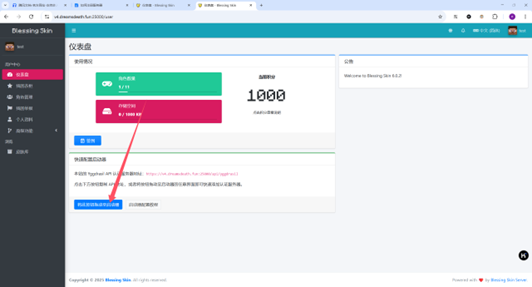
* 这里以PCL为例，当拖拽按钮进入后，输入您的账户密码，然后单击启动游戏 
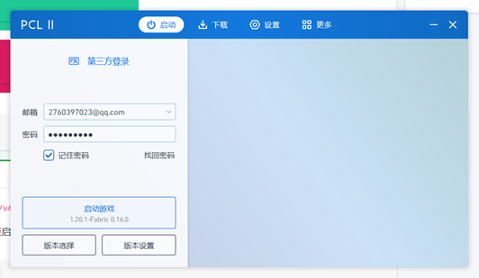
* 加入服务器即可 
### 方法二（同样以PCL为例）
*  
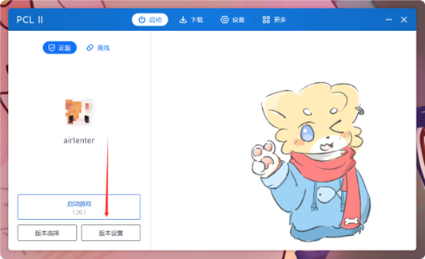
* 
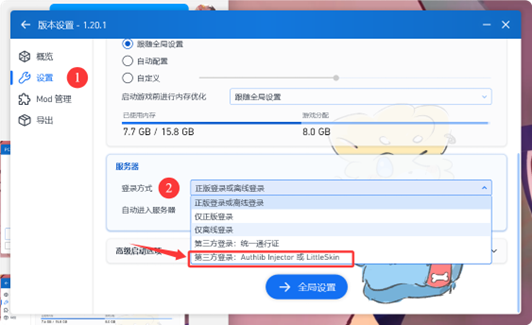
* 
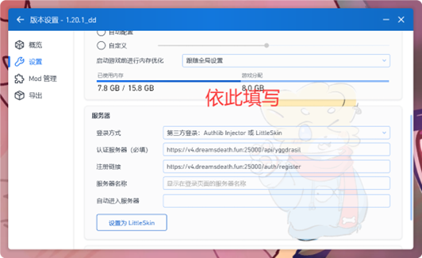 
此处的两条链接分别为 
https://bs.samuge.red/api/yggdrasil 
https://bs.samuge.red/auth/register 
* 登录后启动即可 
## 连接到服务器
* **以1.21.4为例**
* 在启动器点击启动游戏之后，过一段时间能看到类似下图的游戏窗口，点击“多人游戏”
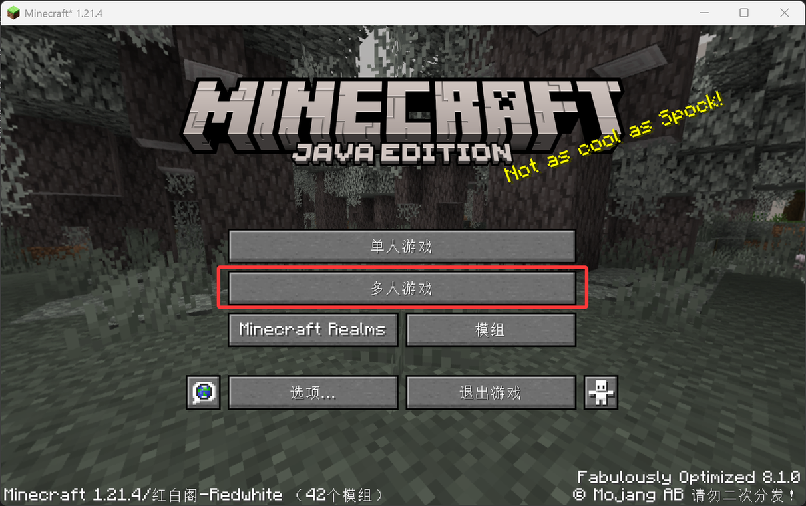 
* 点击“添加服务器”
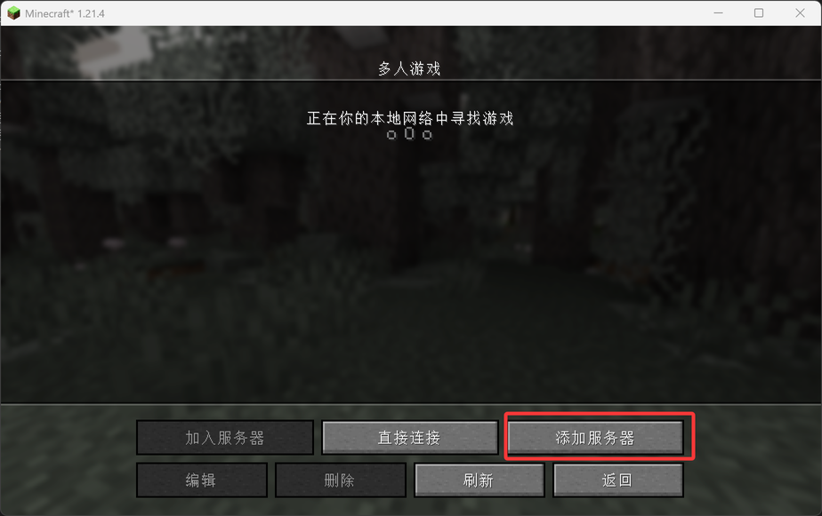 
* 在服务器地址输入mc.samuge.red
* 您也可以修改服务器名称以便于区分，这是可选的
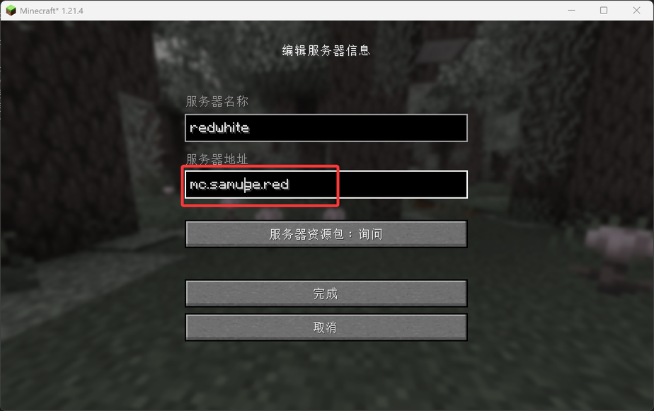 
* 需要注意，请检查下方“服务器资源包”按钮，确保为“询问”（如下图）或“允许”，随后点击“完成”
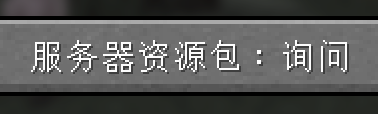 
* 这时服务器列表应该出现了刚才添加的服务器，点击
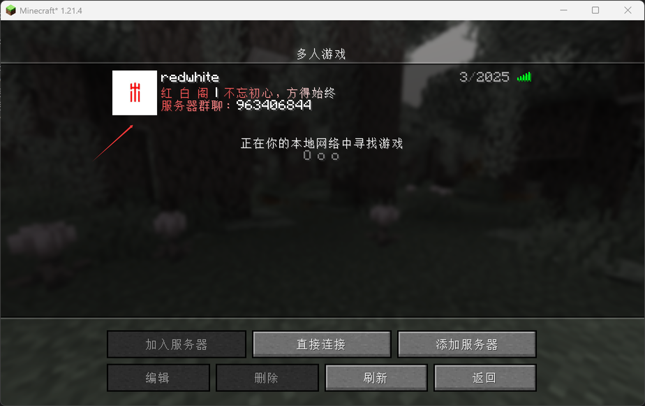 
* 一切顺利的话，会出现下图的提示，点击“继续”即可
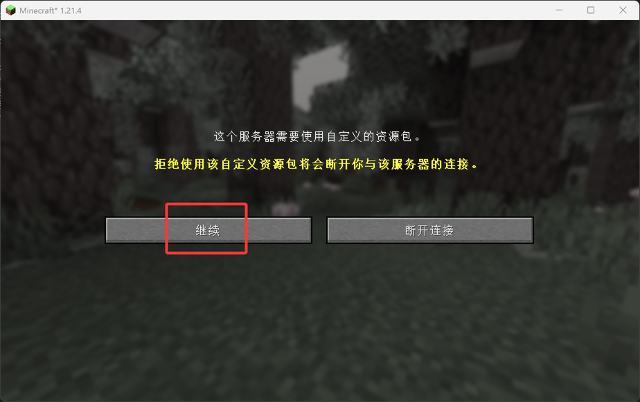 